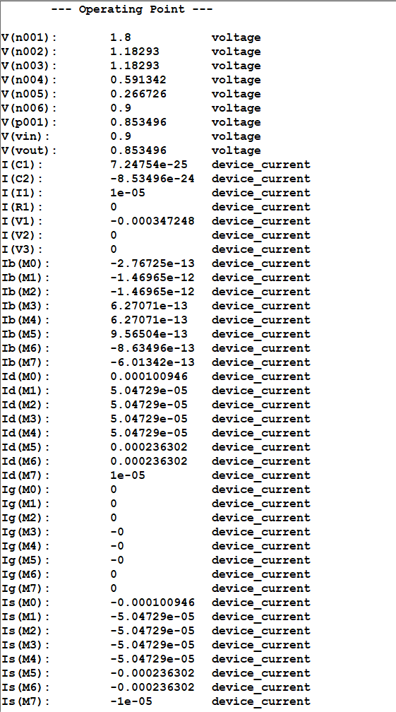

# 2Stage-CMOS-OTA-Design
# 2-Stage CMOS OTA Design in TSMC 180nm

## Overview
Design and simulation of a two-stage CMOS Operational Transconductance Amplifier (OTA) using TSMC 180nm technology.

The OTA is used as a non-inverting amplifier with closed-loop gain of 2.

---

## Specifications

| Parameter | Value |
|---|---|
| Technology | TSMC 180nm |
| Supply Voltage | 1.8V |
| Open Loop Gain | 56.6 dB |
| Phase Margin | 88.3° |
| Closed Loop Gain | 2 |

---

## OTA Architecture

- Differential input pair
- Current mirror active load
- Common source second stage
- Bias current source

---

## Transistor Dimensions

| MOSFET | W/L |
|---|---|
| M0 | 10.86u / 0.18u |
| M1-M2 | 5.434u / 0.18u |
| M3-M4 | 12.5u / 0.18u |
| M5 | 56u / 0.18u |
| M6 | 19.566u / 0.18u |
| M7 | 0.39132u / 0.18u |

---

## Simulation Results

### Open Loop Response


### Closed Loop Step Response



---

## Project Structure

```text
report/          -> Final report
calculations/    -> Hand calculations
spice/           -> LTspice schematic files
images/          -> Simulation plots
schematics/      -> Circuit schematic images

